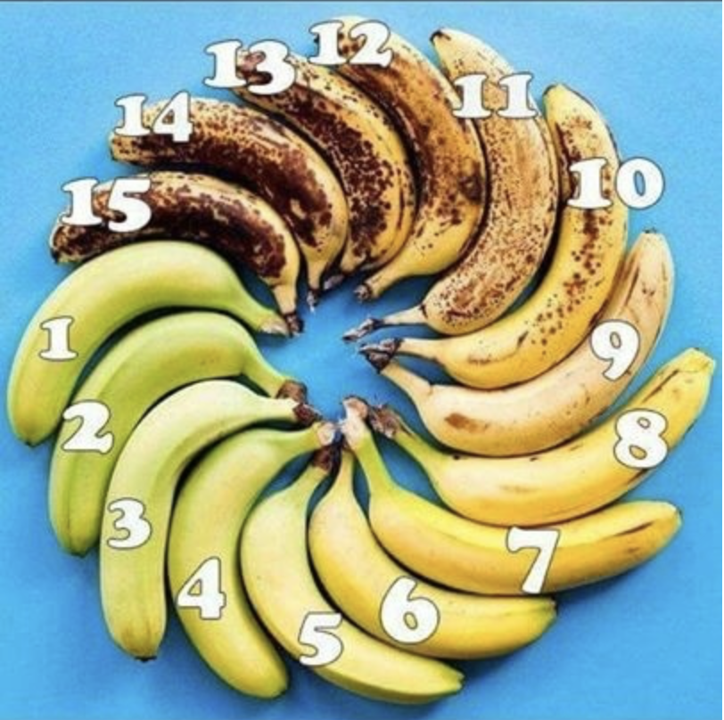
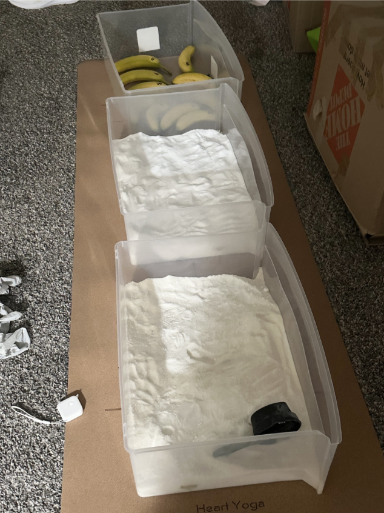
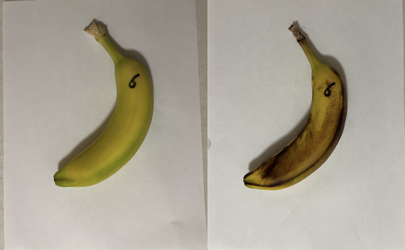
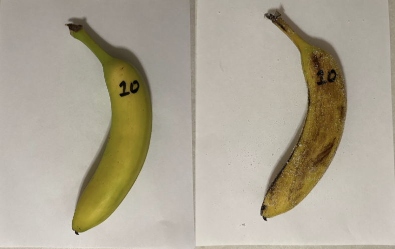

# Introduction

# Experiment Procedure
Every 24 hours at 9pm when there is no more sunlight, one group member (Jia Guo) takes pictures of all 30 bananas individually. The experiment lasted a total of 5 days from October 17 to October 21, 2024, so there was a total of 150 banana pictures. For the first day, labeled as "Day 1" in our dataset is a picture of the bananas before any treatment was applied so that we will have the original banana colors. The angle and height of all pictures were kept as consistent as possible and a lamp, approximately 10 inches in height, was used a height reference. In order to prevent the bacteria from our hands to contaminate the banana, sugar, and salt, nitrile exam gloves from Costco were used whenever taking pictures and handling the experiment subjects. For the positioning of the bananas inside the plastic boxes, there was no spatial randomization and no planning was done to keep orientation of the all bananas consistent. Due to the limitation of the size of the boxes, bananas were simply put into the boxes in whatever way first without having any of the bananas touching each other. We attemppted to keep the position of the banana as identical as we can but due to the nature of the experiment, we had to dig a hole in the sugar and salt to place the banana each time which prevents us from keeping the positions perfectly identical.

Five participants was recruited to rate the bananas and the participants were the parents and siblings of our group members. We were unable to send emails, share google drive, or send out a surveys due to regulations in China which ban the usage of many websites. To overcome this, all banana pictures were rated through WeChat where each member would initiate a facetime and record participant responses with our cameras turned off to prevent participants from seeing us. To prevent our reactions and physical gestures from influencing participant responses we turned off our cameras. We screenshared pictures of the banana with a split screen, one half of the screen will have the scale and the other half of the screen will be used to flip through 30 banana pictures. All responses and pictures are recorded and uploaded onto the Github repository. Each participants responded everyday and rated 30 bananas. We are extremely grateful to their participation as their involvement was crucial to the experiment.  

```{r, banana scale, echo = F, fig.width = 6, fig.height = 4, fig.align = 'center', fig.cap = "Banana color scale used for rating bananas", cache = F}

```

To ensure that the experiment had consistent and reliable responses from the participants, two "dummy" bananas were put additionally into the pictures on days 1, 3, and 5.

```{r, dummy banana, echo = F, fig.width = 6, fig.height = 4, fig.align = 'center', fig.cap = "Dummy banana used for ensuring consistency and reliability of responses", cache = F}

```

The left banana was a screen shot of banana number 7, the purpose of this banana was to ensure that all participants would accurately evaluate the left picture as a 7 and make sure that they are reading the scale correctly. The right banana was used to ensure consistency, if the banana pictures to not vary across different days, then the participant responses should not vary as well. On all 3 days these pictures were presented, participants were able to correctly identify the left pictured banana as a 7 and the right picture banana consistently fell into the acceptable range of 6-9 that was decided by the group members. 

```{r, experiment picture, echo = F, fig.width = 6, fig.height = 4, fig.align = 'center', fig.cap = "Picture of the actual experiment setup", cache = F}

```

```{r, banana 6, echo = F, fig.width = 6, fig.height = 4, fig.align = 'center', fig.cap = "Example of data collection, this is day 1 vs day 5 for banana number 6", cache = F}

```

```{r, banana 10, echo = F, fig.width = 6, fig.height = 4, fig.align = 'center', fig.cap = "Example of data collection, this is day 1 vs day 5 for banana number 10", cache = F}

```

The above figures shows our experiment setup as well as an example of the data. The experiment has 3 buckets with banana completely buried in the treatment salt and sugar. The example of the data illustrates how we kept the angle, lighting, white background, and height of the picture consistent from day 1 through day 5. The reasons for doing so will lead us to discuss all of the nuisance and confounder variables that our experiment design tries to control for. Our group thought very deeply about the following variables: temperature, humidity, sunlight exposure, lighting for picture, and camera quality. Specifically for camera quality, a majority of cameras have automatic color adjustments and smoothen features in the photo which creates an effect where a photograph of an object may appear better than how it looks in real life. We wanted to control for all of these variables because we believe that an excellent experiment design should be reproducible and should to the best of our ability eliminate all variables that can possibly affect the experiment. The goal is to focus only on the effects of the treatment. 

To control for temperature we set the thermostat to "auto" mode to maintain a consistent 68 degree Fahrenheit, which is the average room temperature for most homes. There is a belief that higher temperatures can allow a banana to ripen more quickly and in Michigan, the temperature varies drastically throughout the day so we decided to control the temperature in the room. The humidity was set to 40\% which is the recommended humidity level for humans. We eliminated sunlight exposure by keeping the experiment behind a wall that prevents the sunlight from reaching any of the bananas. For the lighting of the picture, we decided that natural light is too inconsistent because it's possible that one day it might rain or be cloudy and the pictures being rated will not be consistent. The experiment will only take place at night and to ensure consistent lighting we decided to use a 60 watt, 4000k cool white lightbulb. Specifically white light was preferred over yellow light because for photography reasons white light can lead to less color auto-adjustments and capture photos "true to life." For camera quality, as Apple commercials always claim that higher generations of iPhones have better camera features, we decided to use the iPhone 14 pro max which was the highest generation among the group. The HDR camera setting was turned off on the iPhone because Apple's support page stated that this was the best way to capture "true to life" photos. One major reason we decided to focus on so many details for this experiment is because we want it to be reproducible. Regardless of where in the world and what time of the year it is, all of these features regarding room condition and camera quality have been controlled and can be replicated with some basic equipment. By having such strict control over all of these variables, we might be limiting the possibility of generalizing these findings of the experiment but we still believe that all of these experiment details are crucial for reproducibility. If there was a lack of control over things like room condition, then the experiment will be difficult to reproduce. 

# Data
All of the data is put into the Github. The data consists of the following: an experiment diary recording the details of the experiment across 5 days that focuses on describing the process of collecting the data, the data itself that is stored in an excel sheet, and the raw photos of a total of 150 bananas. The data has a recorded weight for all the bananas before treatment was applied and columns for 5 days each with the ratings from 5 participants. 

# Exploratory Data Analysis
NEED PEIYAO PLOTS FOR EDA
The first thing that needed to be checked was confirming that none of the banana ratings are reversing in age. The overall trend that we see from the figure is that the ratings are increasing as expected. There's a few bananas that might have decreased in rating on one day but those were humans errors that the group was willing to accept. No data entries were thrown out and no data cleaning was done. The second thing we wanted to check was to see if there was any grader bias. If one grader is always rating the bananas with a high value then this is something we must consider in our analysis. From the figure we see that for the most part, except for one grader who on average rated a little bit lower than the other participants, we have consistent ratings. This informed us to not consider the grader effect as part of our analysis for treatment effect. 