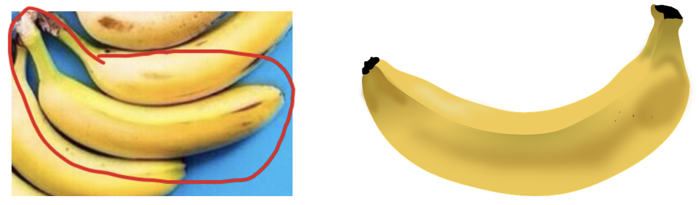

# Introduction

Many people find themselves frustrated with overripe bananas, especially when they ripen faster than expected, leading to waste and unwanted texture changes. This experiment addresses a common household challenge: identifying simple methods to slow the ripening process of bananas. By investigating the effects of common preservatives, this study aims to provide a practical, easily implemented solution for households. Specifically, it examines how accessible items like iodized salt and granulated sugar, known for their preservative qualities, might help extend banana freshness.

The central question guiding this experiment is whether burying a banana in iodized salt or granulated sugar can effectively slow down its ripening process. Both salt and sugar are widely used as natural preservatives due to their ability to inhibit microbial growth and delay spoilage in various foods. By examining the effects of these substances on bananas, the experiment seeks to determine if either method offers a viable, low-cost solution to prolong banana shelf life, thus reducing food waste.

Although iodized salt was chosen for its accessibility, it may not function as an effective preservative in the same way as dedicated preservation salts. True preservation salts, such as canning or pickling salt, lack additives like iodine or anti-caking agents present in table salt. These additives, though harmless in cooking, may impact the salt’s ability to draw out moisture effectively—a critical factor in slowing bacterial growth and decay. By using iodized salt, this experiment reflects a typical household approach; however, the preservative effect may be limited compared to canning salt, a factor kept in mind when interpreting the results.

# Experiment Overview

This experiment assessed the effects of common household preservatives, iodized salt and granulated sugar, on the ripening process of bananas. The design included two treatment groups, where bananas were buried in either salt or sugar, and one control group in which no treatment was applied. Both iodized salt and granulated sugar were sourced from Meijer to ensure consistent product quality across treatments.

A total of 30 bananas were obtained from Kroger and randomly divided in a 1:1:1 ratio among the salt, sugar, and control groups. To prevent selection bias, a third party (the brother of a group member) purchased the bananas independently, ensuring that group members had no influence over their selection. This setup aimed to provide an unbiased comparison across treatment and control groups.

Each banana was photographed and rated every 24 hours, allowing for consistent tracking of color changes, the primary indicator of ripening. These observations were conducted over five days, capturing the progression of ripeness across different conditions. This systematic approach was designed to highlight any delays in ripening due to the preservative effects of salt or sugar compared to untreated bananas.

# Randomization and Blinding

To control for variations in banana size, a randomized block design was used. Each banana was weighed, numbered, and categorized into three size blocks—small (142-163 grams), medium (164-190 grams), and large (191-226 grams). Within each block, bananas were randomly assigned to one of the three treatment groups: salt, sugar, or control. This ensured that each group contained 3 small, 4 medium, and 3 large bananas, balancing potential size-related effects on ripening across treatments.

The experiment was conducted in three separate, covered boxes, each designated for one treatment: one filled with salt, one with sugar, and one left empty as a control. To maintain blinding, the boxes were made visually indistinguishable. A third party (the brother of a group member) selected a randomization seed and assigned labels A, B, and C to the boxes, preventing group members from knowing which treatment each box contained. This method provided a double-blind setup, as neither the group members nor the participants responsible for rating could identify the treatment conditions.

Despite initial efforts to maintain a double-blind setup, challenges arose on the first day of the experiment. Distinguishing control bananas from the treated ones became unavoidable. Handling the bananas revealed textural differences, as the sugar and salt adhered to the banana skins, making the treatment groups identifiable by touch and appearance. Washing or rubbing off the salt and sugar was avoided to prevent damaging the banana skin, which could interfere with the natural ripening process.

To address these limitations, we implemented adjustments to minimize bias. Although distinguishing between treated and untreated bananas was inevitable, the distinction between the salt and sugar treatments remained less obvious. Consequently, group members refrained from participating in the banana ratings, and instead, external participants were recruited. These participants were kept unaware of the experiment's purpose and methodology. By limiting participants’ knowledge of the experimental design, the approach aimed to minimize knowledge-based bias and preserve the double-blind intent as much as possible, ensuring that ratings were unbiased and solely based on observable ripening characteristics.

# Experiment Procedure
Every 24 hours at 9pm when there is no more sunlight, one group member (Jia Guo) takes pictures of all 30 bananas individually. The experiment lasted a total of 5 days from October 17 to October 21, 2024, so there was a total of 150 banana pictures. For the first day, labeled as "Day 1" in our dataset is a picture of the bananas before any treatment was applied so that we will have the original banana colors. The angle and height of all pictures were kept as consistent as possible and a lamp, approximately 10 inches in height, was used a height reference. In order to prevent the bacteria from our hands to contaminate the banana, sugar, and salt, nitrile exam gloves from Costco were used whenever taking pictures and handling the experiment subjects. For the positioning of the bananas inside the plastic boxes, there was no spatial randomization and no planning was done to keep orientation of the all bananas consistent. Due to the limitation of the size of the boxes, bananas were simply put into the boxes in whatever way first without having any of the bananas touching each other. We attemppted to keep the position of the banana as identical as we can but due to the nature of the experiment, we had to dig a hole in the sugar and salt to place the banana each time which prevents us from keeping the positions perfectly identical.

Five participants was recruited to rate the bananas and the participants were the parents and siblings of our group members. We were unable to send emails, share google drive, or send out a surveys due to regulations in China which ban the usage of many websites. To overcome this, all banana pictures were rated through WeChat where each member would initiate a facetime and record participant responses with our cameras turned off to prevent participants from seeing us. To prevent our reactions and physical gestures from influencing participant responses we turned off our cameras. We screenshared pictures of the banana with a split screen, one half of the screen will have the scale and the other half of the screen will be used to flip through 30 banana pictures. All responses and pictures are recorded and uploaded onto the Github repository. Each participants responded everyday and rated 30 bananas. We are extremely grateful to their participation as their involvement was crucial to the experiment.  

```{r, banana scale, echo = F, fig.width = 6, fig.height = 4, fig.align = 'center', fig.cap = "Banana color scale used for rating bananas", cache = F}
knitr::include_graphics("images/banana_scale.png")
```

To ensure that the experiment had consistent and reliable responses from the participants, two "dummy" bananas were put additionally into the pictures on days 1, 3, and 5.

```{r, dummy banana, echo = F, fig.width = 6, fig.height = 4, fig.align = 'center', fig.cap = "Dummy banana used for ensuring consistency and reliability of responses", cache = F}

```

The left banana was a screen shot of banana number 7, the purpose of this banana was to ensure that all participants would accurately evaluate the left picture as a 7 and make sure that they are reading the scale correctly. The right banana was used to ensure consistency, if the banana pictures to not vary across different days, then the participant responses should not vary as well. On all 3 days these pictures were presented, participants were able to correctly identify the left pictured banana as a 7 and the right picture banana consistently fell into the acceptable range of 6-9 that was decided by the group members. 

```{r, experiment picture, echo = F, fig.width = 6, fig.height = 4, fig.align = 'center', fig.cap = "Picture of the actual experiment setup", cache = F}
knitr::include_graphics("images/experiment_picture.png")
```

```{r, banana 6, echo = F, fig.width = 6, fig.height = 4, fig.align = 'center', fig.cap = "Example of data collection, this is day 1 vs day 5 for banana number 6", cache = F}
knitr::include_graphics("images/banana_6.png")
```

```{r, banana 10, echo = F, fig.width = 6, fig.height = 4, fig.align = 'center', fig.cap = "Example of data collection, this is day 1 vs day 5 for banana number 10", cache = F}
knitr::include_graphics("images/banana_10.png")
```

The above figures shows our experiment setup as well as an example of the data. The experiment has 3 buckets with banana completely buried in the treatment salt and sugar. The example of the data illustrates how we kept the angle, lighting, white background, and height of the picture consistent from day 1 through day 5. The reasons for doing so will lead us to discuss all of the nuisance and confounder variables that our experiment design tries to control for. Our group thought very deeply about the following variables: temperature, humidity, sunlight exposure, lighting for picture, and camera quality. Specifically for camera quality, a majority of cameras have automatic color adjustments and smoothen features in the photo which creates an effect where a photograph of an object may appear better than how it looks in real life. We wanted to control for all of these variables because we believe that an excellent experiment design should be reproducible and should to the best of our ability eliminate all variables that can possibly affect the experiment. The goal is to focus only on the effects of the treatment. 

To control for temperature we set the thermostat to "auto" mode to maintain a consistent 68 degree Fahrenheit, which is the average room temperature for most homes. There is a belief that higher temperatures can allow a banana to ripen more quickly and in Michigan, the temperature varies drastically throughout the day so we decided to control the temperature in the room. The humidity was set to 40\% which is the recommended humidity level for humans. We eliminated sunlight exposure by keeping the experiment behind a wall that prevents the sunlight from reaching any of the bananas. For the lighting of the picture, we decided that natural light is too inconsistent because it's possible that one day it might rain or be cloudy and the pictures being rated will not be consistent. The experiment will only take place at night and to ensure consistent lighting we decided to use a 60 watt, 4000k cool white lightbulb. Specifically white light was preferred over yellow light because for photography reasons white light can lead to less color auto-adjustments and capture photos "true to life." For camera quality, as Apple commercials always claim that higher generations of iPhones have better camera features, we decided to use the iPhone 14 pro max which was the highest generation among the group. The HDR camera setting was turned off on the iPhone because Apple's support page stated that this was the best way to capture "true to life" photos. One major reason we decided to focus on so many details for this experiment is because we want it to be reproducible. Regardless of where in the world and what time of the year it is, all of these features regarding room condition and camera quality have been controlled and can be replicated with some basic equipment. By having such strict control over all of these variables, we might be limiting the possibility of generalizing these findings of the experiment but we still believe that all of these experiment details are crucial for reproducibility. If there was a lack of control over things like room condition, then the experiment will be difficult to reproduce. 

# Data
All of the data is put into the Github: https://github.com/Jiatong-Liang/STATS604_Project3.git. The data consists of the following: an experiment diary recording the details of the experiment across 5 days that focuses on describing the process of collecting the data, the data itself that is stored in an excel sheet, and the raw photos of a total of 150 bananas. The data has a recorded weight for all the bananas before treatment was applied and columns for 5 days each with the ratings from 5 participants. 

# Exploratory Data Analysis
```{r preprocessing}
library(readxl)
raw =read_xlsx('Info_finfinfin.xlsx')
day1_avg = rowMeans(raw[,5:9])
day5_avg = rowMeans(raw[,25:29])
dif = day5_avg - day1_avg
salt = (raw$Group == 'Salt')
sugar = (raw$Group == 'Sugar')
weight = raw$`Weight1(g)`
data = data.frame(y = dif, salt = as.factor(salt), sugar = as.factor(sugar), weight = weight, day1 = day1_avg)
```

```{r}
hist(raw$`Weight1(g)`, main = 'Histogram of Weights', xlab = 'Weights in grams')
```


```{r}
#plot1
day2_avg = rowMeans(raw[,10:14])
day3_avg = rowMeans(raw[,15:19])
day4_avg = rowMeans(raw[,20:14])

data_all_day = cbind(day1_avg, day2_avg,day3_avg,day4_avg,day5_avg)
days = 1:5

sugar_sub = data_all_day[which(raw$Group == 'Sugar'),]
salt_sub = data_all_day[which(raw$Group == 'Salt'),]
ctrl_sub = data_all_day[which(raw$Group == 'Control'),]


combined_matrix = rbind(sugar_sub, salt_sub, ctrl_sub)


colors = c(rep("green", 10), rep("red", 10), rep("blue", 10))


matplot(t(combined_matrix), type = "l", lty = 1, col = colors, 
        xlab = "Days", ylab = "Y values", main = "Banana Ripeness Dynamics",lwd = 2)
legend("topleft", legend = c("Sugar", "Salt", "Control"), 
       col = c("green", "red", "blue"), lty = 1)
```


```{r}
# Define function to check if there is any decrease in a row from day to day
has_any_decrease <- function(x) any(diff(x) < 0)

# Initialize empty list to store data frames for each replicate that has any decrease
decreasing_replicates <- list()

# Loop through each replicate (1 to 5) to find rows with any decrease across days
for (i in 1:5) {
  # Select columns for the replicate, e.g., Day 1(i), Day 2(i), ..., Day 5(i)
  day_columns <- paste0("Day ", 1:5, "(", i, ")")
  
  # Filter rows where there is any decrease across days
  decreasing_data <- raw %>%
    select(Label, all_of(day_columns)) %>%
    filter(apply(select(., -Label), 1, has_any_decrease)) %>%
    pivot_longer(cols = starts_with("Day"), names_to = "Day", values_to = "Value") %>%
    mutate(Replicate = paste0("Grader ", i))
  
  # Only add to list if there are rows that met the condition
  if (nrow(decreasing_data) > 0) {
    decreasing_replicates[[i]] <- decreasing_data
  }
}

# Check if there is any data to plot
if (length(decreasing_replicates) == 0) {
  message("No rows with any decrease found across the days.")
} else {
  # Combine all decreasing replicates data into a single data frame
  all_decreasing_data <- bind_rows(decreasing_replicates)
  
  # Plot the data with ggplot2
  ggplot(all_decreasing_data, aes(x = Day, y = Value, group = Label, color = Label)) +
    geom_line() +
    geom_point() +
    facet_wrap(~ Replicate) +
    labs(title = "Trends with Any Decrease Across Days for Each Grader",
         y = "Measurement Value",
         color = "Banana identifier") +
    theme_minimal() + theme(
    axis.text.x = element_blank(),    # Remove x-axis text
    axis.ticks.x = element_blank(),   # Remove x-axis ticks
    axis.title.x = element_blank()     # Remove x-axis title
  )
}
```
Here we investigated any banana that had a decrease between consecutive days for all of the graders. Here we just wanted to confirm that there is no significant error and no data cleaning was done to remove these entries. The group decided that these are all natural human errors that was acceptable for the experiment. 

```{r}
g1_avg = colMeans(raw[,c(5,10,15,20,25)])
g2_avg = colMeans(raw[,(c(5,10,15,20,25)+1)])
g3_avg = colMeans(raw[,(c(5,10,15,20,25)+2)])
g4_avg = colMeans(raw[,(c(5,10,15,20,25)+3)])
g5_avg = colMeans(raw[,(c(5,10,15,20,25)+4)])

combined = rbind(g1_avg,g2_avg,g3_avg,g4_avg,g5_avg)
colors = c('green', 'red', 'blue', 'pink', 'yellow')
matplot(t(combined), type = "l", lty = 1, col = colors, 
        xlab = "Days", ylab = "Y values", main =  "Ripeness Grading Dynamics",lwd = 2)
legend("topleft", legend = c("Grader 1", "Grader 2", "Grader 3", "Grader 4", "Grader 5"), 
       col = c("green", "red", "blue","pink", "yellow"), lty = 1)

```


The first thing that needed to be checked was confirming that none of the banana ratings are reversing in age. The overall trend that we see from the figure is that the ratings are increasing as expected. There's a few bananas that might have decreased in rating on one day but those were humans errors that the group was willing to accept. No data entries were thrown out and no data cleaning was done. The second thing we wanted to check was to see if there was any grader bias. If one grader is always rating the bananas with a high value then this is something we must consider in our analysis. From the figure we see that for the most part, except for one grader who on average rated a little bit lower than the other participants, we have consistent ratings. This informed us to not consider the grader effect as part of our analysis for treatment effect.

```{r}
day2_data <- raw %>%
  select(Label, starts_with("Day")) %>%
  select(Label, ends_with("(1)"))

long_day2_data <- day2_data %>%
  pivot_longer(cols = -Label, names_to = "Day", values_to = "Value") %>%
  mutate(Day = factor(Day, levels = c("Day 1(1)", "Day 2(1)", "Day 3(1)", "Day 4(1)", "Day 5(1)")))

ggplot(long_day2_data, aes(x = Day, y = Value, color = Label, group = Label)) +
  geom_line() +
  geom_point() +
  labs(title = "Measurements for All Labels on Days 1 to 5 (2nd grader)",
       x = "Day",
       y = "Measurement Value",
       color = "Banana identifier") +
  theme_minimal() 
```

We randomly sampled one grader from the 5 and decided to plot their ratings for all 30 bananas across 5 days. Overall we see an increasing trend, which is expected, and the decrease in banana ratings on a few days are natural human errors. This same pattern was seen in all 5 graders but only one figure will be shown in this report. 

## Statistical Tests
```{r difference in means}
library(tidyverse)
dif_ctrl = dif[which(raw$Group == 'Control')]
dif_salt = dif[which(raw$Group == 'Salt')]
dif_sugar = dif[which(raw$Group == 'Sugar')]

dif_list = list(Control = dif_ctrl, Salt = dif_salt, Sugar = dif_sugar)

boxplot(dif_list,
        main = "Boxplot of Three Groups", 
        xlab = "Groups", 
        ylab = "Difference in Ripeness",
        col = c("lightblue", "lightgreen", "lightpink"))
```

In this section, we examine the treatment effects of burying bananas in sugar and salt on their ripeness levels. 
We start by a simple visualization of our results.
We define response variable $Y$ as the change in ripeness level from day 1 to day 5 for each single bananas. 
Next, we create box plots for the salt group, sugar group, and control group. 
As shown in the figure above, the distribution of the salt group is very similar to the control group, and the sugar group seems to be significantly lower than the other two groups in the ripeness level. 
To provide statistical guarantees, we apply a t-test, permutation test, and linear regression to further validate our conclusions.

Firstly, we compare the ripeness of treatment groups (salt or sugar) with control group by using two-sample t tests, the results are given as follows
```{r t test}
t.test(dif_ctrl, dif_salt)
t.test(dif_ctrl, dif_sugar)
```

The p value for the sugare group is tiny, hence supporting our conclusions.

For the permutation test, considering for each treatment+ control group, we have $20$ data points and fully permuting all treatments will induce high computing burdens ($2^{20}$ operations).
To this end, we consider using blocked permuting test.
We group our bananas into 3 sub groups by their weights (light, medium, heavy).
Each treatment group contains 10 bananas, and the 10 bananas include 3 light, 4 medium and 3 heavy bananas.
We only permute the treatment inside the weight groups.
The testing procedures are given as follows, we firstly consider salt group:

```{r}
library(tidyverse)
observed_difference = mean(dif_salt) - mean(dif_ctrl)
small_idx = which((raw$size == 'small')&(raw$Group!='Sugar'))
medium_idx = which((raw$size == 'medium')&(raw$Group!='Sugar'))
large_idx = which((raw$size == 'large')&(raw$Group!='Sugar'))

idx_rank = c(small_idx, medium_idx, large_idx)
dif_all = dif[idx_rank]
blockAcombos = combn(6,3)
blockBcombos = combn(8,4)+6
blockCcombos = combn(6,3)+14
blockcombos = matrix(NA, 10, ncol(blockAcombos)*ncol(blockBcombos)*ncol(blockCcombos))
blockcombos[1,] = rep(blockAcombos[1,], each=ncol(blockBcombos)*ncol(blockCcombos))
blockcombos[2,] = rep(blockAcombos[2,], each=ncol(blockBcombos)*ncol(blockCcombos))
blockcombos[3,] = rep(blockAcombos[3,], each=ncol(blockBcombos)*ncol(blockCcombos))
blockcombos[4,] = rep(rep(blockBcombos[1,], each = ncol(blockCcombos)), times = ncol(blockAcombos))
blockcombos[4,] = rep(rep(blockBcombos[1,], each = ncol(blockCcombos)), times = ncol(blockAcombos))
blockcombos[5,] = rep(rep(blockBcombos[2,], each = ncol(blockCcombos)), times = ncol(blockAcombos))
blockcombos[6,] = rep(rep(blockBcombos[3,], each = ncol(blockCcombos)), times = ncol(blockAcombos))
blockcombos[7,] = rep(rep(blockBcombos[4,], each = ncol(blockCcombos)), times = ncol(blockAcombos))
blockcombos[8,] = rep(blockCcombos[1,], times = ncol(blockAcombos) * ncol(blockBcombos))
blockcombos[9,] = rep(blockCcombos[2,], times = ncol(blockAcombos) * ncol(blockBcombos))
blockcombos[10,] = rep(blockCcombos[3,], times = ncol(blockAcombos) * ncol(blockBcombos))

# Permutation test:
combos = blockcombos
permN = ncol(combos)
diffs = rep(NA, permN)
for (i in 1:permN){
permx = rep(0,20)
permx[combos[,i]] = 1
diffs[i] = sum(dif_all[permx==1])/10 - sum(dif_all[permx==0])/10
}
hist(diffs,main='Histogram of difference-in-means (salt group)', xlab='difference-in-means')
print(mean(diffs > observed_difference))
```

The p-value is around $0.2$, not significant.
Next we consider the sugar group:
```{r}
library(tidyverse)
dif_ctrl = dif[which(raw$Group == 'Control')]
dif_salt = dif[which(raw$Group == 'Salt')]
dif_sugar = dif[which(raw$Group == 'Sugar')]

observed_difference = mean(dif_sugar) - mean(dif_ctrl)
small_idx = which((raw$size == 'small')&(raw$Group!='Salt'))
medium_idx = which((raw$size == 'medium')&(raw$Group!='Salt'))
large_idx = which((raw$size == 'large')&(raw$Group!='Salt'))

idx_rank = c(small_idx, medium_idx, large_idx)
dif_all = dif[idx_rank]
blockAcombos = combn(6,3)
blockBcombos = combn(8,4)+6
blockCcombos = combn(6,3)+14
blockcombos = matrix(NA, 10, ncol(blockAcombos)*ncol(blockBcombos)*ncol(blockCcombos))
blockcombos[1,] = rep(blockAcombos[1,], each=ncol(blockBcombos)*ncol(blockCcombos))
blockcombos[2,] = rep(blockAcombos[2,], each=ncol(blockBcombos)*ncol(blockCcombos))
blockcombos[3,] = rep(blockAcombos[3,], each=ncol(blockBcombos)*ncol(blockCcombos))
blockcombos[4,] = rep(rep(blockBcombos[1,], each = ncol(blockCcombos)), times = ncol(blockAcombos))
blockcombos[4,] = rep(rep(blockBcombos[1,], each = ncol(blockCcombos)), times = ncol(blockAcombos))
blockcombos[5,] = rep(rep(blockBcombos[2,], each = ncol(blockCcombos)), times = ncol(blockAcombos))
blockcombos[6,] = rep(rep(blockBcombos[3,], each = ncol(blockCcombos)), times = ncol(blockAcombos))
blockcombos[7,] = rep(rep(blockBcombos[4,], each = ncol(blockCcombos)), times = ncol(blockAcombos))
blockcombos[8,] = rep(blockCcombos[1,], times = ncol(blockAcombos) * ncol(blockBcombos))
blockcombos[9,] = rep(blockCcombos[2,], times = ncol(blockAcombos) * ncol(blockBcombos))
blockcombos[10,] = rep(blockCcombos[3,], times = ncol(blockAcombos) * ncol(blockBcombos))

# Permutation test:
combos = blockcombos
permN = ncol(combos)
diffs = rep(NA, permN)
for (i in 1:permN){
#print(i)
permx = rep(0,20)
permx[combos[,i]] = 1
diffs[i] = mean(dif_all[permx==1]) - mean(dif_all[permx==0])
}
hist(diffs,main='Histogram of difference-in-means (sugar group)', xlab='difference-in-means')
mean(diffs <= observed_difference)
```
We have a tiny p-value, hence supporting our claim.

Finally, we consider the linear regression model $\mathrm{Ripeness}_i = a + b*\mathrm{weight}_i + c*1\{\mathrm{salt}_i \} + d*1\{\mathrm{sugar}_i \} + e*\mathrm{day1RipenLevel_i} + \epsilon_i$.
The linear regression result is shown below:

```{r regression}
lm_obj = lm(y~., data = data)
summary(lm_obj)
```
We can see that the sugar indicator is significantly negative in the regression result.
Putting all pieces together, our statsitical test results together show that burying bananas in sugar can alleviate banana ripeness.

# Conclusion
Overall we have seen that there is evidence suggesting that burying bananas in granulated sugar will slow down the ripening process whereas using iodized salt is ineffective. One possible improvement to this experiment is exploring the usage of canning salt instead of iodized salt. Prior to this experiment, the group did not realize that not all forms of salt are preservatives. In fact, to make pickled vegetables, iodized salt is not recommended and typically to preserve food one would use canning salt. 